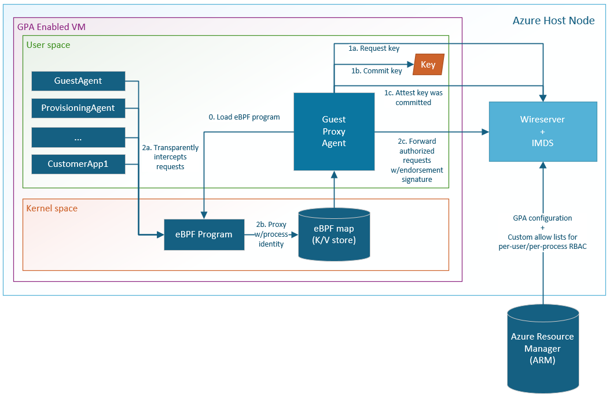

# Microsoft Azure Guest Proxy Agent

## Introduction

This project introduces the Guest Proxy Agent (GPA) to enhance the security of the Azure Instance Metadata Service
and Azure Wireserver endpoints (available in Azure IaaS VM/VMSS at `169.254.169.254` and `168.63.129.16` respectively).
Analogous metadata servers are offered from the majority of cloud providers.

These services are used for providing metadata and bootstrapping VM credentials. As a result, they are frequently
targeted by threat actors. Common vectors include confused deputy attacks (e.g. SSRF) against in guest workloads and
sandbox escapes, which are of particular concern for hosted-on-behalf-of workloads where untrusted code is intentionally
loaded into the VM.

With metadata services, the trust boundary is the VM itself. Any software within the guest is authorized to request
secrets from IMDS. VM owners are responsible for carefully sandboxing any software they run inside the VM and ensuring
that external actors can't exfiltrate data. This is achievable, but in practice the complexity of the problem leads to
mistakes at scale which in turn lead to exploits.

While numerous defense in depth strategies exist, providing secrets over an unauthenticated HTTP API carries inherent risk.
This project closes many of the most common vulnerabilities by addressing the root cause of these attacks and introducing
strong Authentication (AuthN) and Authorization (AuthZ) concepts to cloud metadata services.

## Implementation

The GPA hardens against these types of attacks by:

- Limiting metadata access to a subset of the VM (applying the principle of least privileged access).
- Switching from a "default-open" to "default-closed" model. For instance, with nested virtualization a misconfigured L2
  VM that has access to the L1 VM's vNIC can communicate with a metadata service as the L1. With the GPA, a misconfigured
  L2 would no longer be able to gain access, as it would be unable to authenticate with the service.

At provisioning time the metadata service establishes a trusted delegate within the guest (the GPA). A long-lived
secret is negotiated to authenticate with the trusted delegate, and all requests to the metadata service must be
endorsed by the delegate using an [HMAC](https://en.wikipedia.org/wiki/HMAC). This establishes a point-to-point trust
relationship with strong AuthN.

The GPA leverages [eBPF](https://ebpf.io/what-is-ebpf/) to intercept HTTP requests to the metadata services. eBPF
enables the GPA to authoritatively verify the identity of the in guest software that made the request without introducing
an additional kernel module. Using this information, it compares the identity of the client against an allow list defined
as a part of the VM model in the Azure Resource Manager (ARM) and endorses requests that are authorized by transparently
adding a signature header. This means that the feature can be enabled on existing workloads without breaking changes.

- By default, the existing authorization levels are enforced: IMDS is open to all users and Wireserver is root / admin only.
  - Today this restriction is accomplished with firewall rules in the guest. This is still a default-open mechanism,
    because if that rule can be disabled or bypassed for any reason the metadata service will accept the request. The
    AuthN mechanism enabled here default-closed. Bypassing interception maliciously or by error does not grant access to
    the metadata service.
- Advanced AuthZ configuration to authorize specific in-guest processes and users to access only specific endpoints is
  supported by defining a custom allow list with RBAC semantics.

## Compatibility

eBPF is available in Linux kernels 5.15+ and on Windows VMs by installing [eBPF-for-Windows](https://github.com/microsoft/ebpf-for-windows).
The design is not dependent on any modern security hardware, but it can be further enhanced by hardware like vTPM when
available.

This project supports Azure VMs running:

- Windows 10 or later
- Windows Server 2019 or later
- Ubuntu 20.04+
- Redhat 9+
- Flatcar
- Rocky-Linux9+
- SUSE 15 SP4+

## Architectural Overview

The following diagram shows the basic architecture of this project and related components:

## Development

Refer to the instructions that correspond to the Operating System you wish to *target*:

- [Getting Started Guide - Linux](/doc/GettingStartedLinux.md)
- [Getting Started Guide - Windows](/doc/GettingStartedWindows.md)

## Contributing

This project welcomes contributions and suggestions. Most contributions require you to agree to a
Contributor License Agreement (CLA) declaring that you have the right to, and actually do, grant us
the rights to use your contribution. For details, visit <https://cla.opensource.microsoft.com>.

When you submit a pull request, a CLA bot will automatically determine whether you need to provide
a CLA and decorate the PR appropriately (e.g., status check, comment). Simply follow the instructions
provided by the bot. You will only need to do this once across all repos using our CLA.

This project has adopted the [Microsoft Open Source Code of Conduct](https://opensource.microsoft.com/codeofconduct/).
For more information see the [Code of Conduct FAQ](https://opensource.microsoft.com/codeofconduct/faq/) or
contact [opencode@microsoft.com](mailto:opencode@microsoft.com) with any additional questions or comments.

## Telemetry

The GPA can emit diagnostic and audit telemetry from the VM locally and/or to Azure for analysis. The collected events
are labeled `Azure GuestProxyAgent logs`. Engineering teams and support professionals can use this telemetry to
understand metadata service usage in their workload, investigate issues, and detect hostile actors.

## Trademarks

This project may contain trademarks or logos for projects, products, or services. Authorized use of Microsoft
trademarks or logos is subject to and must follow [Microsoft's Trademark & Brand Guidelines](https://www.microsoft.com/en-us/legal/intellectualproperty/trademarks/usage/general).
Use of Microsoft trademarks or logos in modified versions of this project must not cause confusion or imply Microsoft
sponsorship. Any use of third-party trademarks or logos are subject to those third-party's policies.
