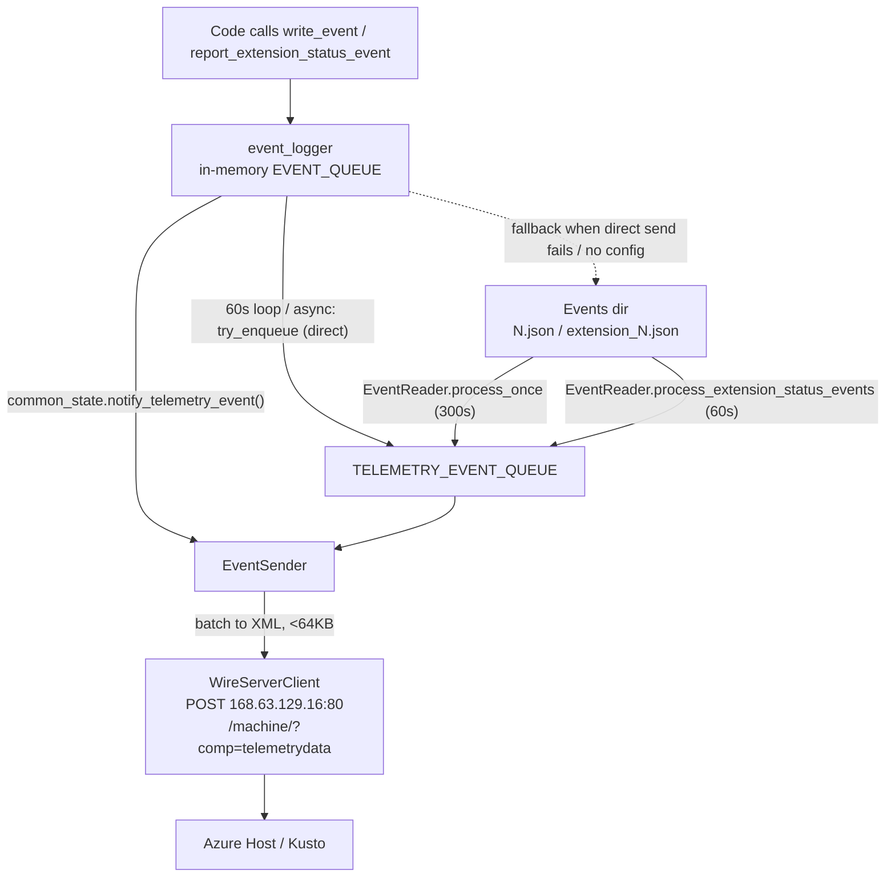

# Telemetry Event Flow

This document describes how telemetry events are produced, buffered, read, and
sent out of the VM by the GuestProxyAgent.

The telemetry system lives in `proxy_agent_shared/src/telemetry/` and is a
**producer → disk buffer → reader → queue → wire-server** pipeline composed of
four cooperating async tasks. All four are spawned in
[provision.rs](../proxy_agent/src/provision.rs).

## End-to-end flow

## Stage 1 — Production (in-memory)

File: `proxy_agent_shared/src/telemetry/event_logger.rs`

- Application code calls `write_event` / `write_event_only` (generic logs) or
  `report_extension_status_event` (extension status).
- `write_event` / `write_event_only` **always** push the event into a bounded
  in-memory `EVENT_QUEUE` (capacity 1000). Messages are truncated to 4 KB
  (`MAX_MESSAGE_LENGTH`).
- A background loop in `event_logger::run_event_loop` wakes **every 60 seconds**
  and drains `EVENT_QUEUE`. The loop is started through one of two entry points:
  - `event_logger::start_with_direct_send` (proxy agent service): each event is
    first attempted on the **direct in-memory send path**
    (`event_sender::try_enqueue_generic_event`), which converts it and pushes it
    straight into the `EventSender`'s `TELEMETRY_EVENT_QUEUE`. If at least one
    event was enqueued directly, the loop calls
    `common_state.notify_telemetry_event()` to wake the sender. Only events that
    cannot be enqueued directly fall back to disk.
  - `event_logger::start` (disk-only, e.g. the extension): the loop buffers
    every event on disk and never references the direct send path. Keeping the
    direct-send code out of this entry point lets dead-code elimination drop the
    `event_sender` machinery from binaries that only buffer to disk.
- `report_extension_status_event` (async) tries the direct path first via
  `event_sender::try_enqueue_extension_event` and, on success, notifies the
  sender and returns; otherwise it falls back to disk.

### DirectSendConfig

- `DirectSendConfig` is defined in `event_logger.rs` and carries the
  `execution_mode`, `event_name`, optional `version`, and a `CommonState`
  handle (used to notify the sender).
- It is passed into `event_logger::start_with_direct_send(..., direct_send_config, ...)`
  by the proxy agent service (see [provision.rs](../proxy_agent/src/provision.rs))
  and also cached in a static `DIRECT_SEND_CONFIG` so
  `report_extension_status_event` can use it.
- The `execution_mode` / `event_name` / `version` match the `EventReader`
  configuration so events are shaped identically regardless of which path they
  take.

## Stage 2 — Disk buffer (fallback only)

- The on-disk buffer is now a **fallback**, used only when the logger is started
  without a `DirectSendConfig` (via `event_logger::start`) or the in-memory send
  queue (`TELEMETRY_EVENT_QUEUE`) is full/closed. This lets VMs without disk
  write permission still report telemetry over the direct path.
- Processes that pass a `DirectSendConfig` (the proxy agent service, via
  `event_logger::start_with_direct_send`) send most events directly. Processes
  that do not (e.g. the extension, which calls the disk-only `event_logger::start`)
  keep the original disk-only behavior.
- Two file types act as the durable fallback buffer:
  - Generic logs: `^[0-9]+\.json$` → `TelemetryGenericLogsEvent`
  - Extension status: `^extension_[0-9]+\.json$` → `TelemetryExtensionEventsEvent`
- If the direct send succeeds, the disk is never touched. If it falls back, the
  file-count cap (`max_event_file_count` for generic,
  `MAX_EXTENSION_EVENT_FILE_COUNT` for extension) still applies as backpressure.

## Stage 3 — Reading & enqueueing

File: `proxy_agent_shared/src/telemetry/event_reader.rs`

Two independent reader loops:

- `start` → `process_once` runs **every 300s**: reads generic `*.json` files,
  converts each to a `TelemetryEvent::GenericLogsEvent`, enqueues into
  `TELEMETRY_EVENT_QUEUE`, then **deletes the file**.
- `start_extension_status_event_processor` → `process_extension_status_events`
  runs **every 60s**: same for `extension_*.json` →
  `TelemetryEvent::ExtensionEvent`.
- Optional `EventReaderLimits` enforce max events/round and max file size;
  oversized files are deleted to avoid blocking.
- After enqueueing, each calls `common_state.notify_telemetry_event()` to wake
  the sender.

## Stage 4 — Sending out of the VM

File: `proxy_agent_shared/src/telemetry/event_sender.rs`

- `EventSender::start` waits on a `notify` (or cancellation). The notify is
  signaled both by `event_logger` (direct path) and by the `EventReader` (disk
  path) via `common_state.notify_telemetry_event()`. On notify it calls
  `process_event_queue`:
  1. Refreshes VM metadata via `WireServerClient` + `ImdsClient`.
  2. Builds `TelemetryEventVMData` (tenant, role, subscription, VM id, OS, RAM,
     CPU…).
  3. `send_events` batches queued events into `TelemetryData`, capping each
     payload at **64 KB** (`MAX_MESSAGE_SIZE`); oversized single events are
     dropped, otherwise re-enqueued.
  4. Serializes to the Azure telemetry XML format
     (`telemetry_event.rs`) with provider IDs:
     - Generic logs: `FFF0196F-EE4C-4EAF-9AA5-776F622DEB4F`
     - Extension status: `69B669B9-4AF8-4C50-BDC4-6006FA76E975`

## The actual exit point

File: `proxy_agent_shared/src/host_clients/wire_server_client.rs`

- `send_telemetry_data` POSTs the XML to the **Azure WireServer at
  `168.63.129.16:80`**, path `/machine/?comp=telemetrydata`, headers
  `x-ms-version: 2012-11-30` and `Content-Type: text/xml`.
- The sender retries up to **5 times with 15s backoff** on failure. This is the
  single egress path; from there the Azure host platform forwards events to its
  telemetry backend.

## Key design points

- **Durability:** events survive on disk between produce and send; only deleted
  after being enqueued for sending.
- **Backpressure at every stage:** bounded in-memory queues (1000), file-count
  caps, message-size caps (4 KB per message, 64 KB per payload).
- **Cancellation-aware:** all tasks listen to the shared `CancellationToken`;
  the sender closes `TELEMETRY_EVENT_QUEUE` on shutdown.
- **No signing required** for the telemetry POST (unlike other wire-server
  calls).

## Latency note

With the direct in-memory path enabled (proxy agent service):

- **Generic events** typically leave the VM within ~60 seconds (the
  `event_logger` loop interval), since they are enqueued straight into the send
  queue and the sender is notified.
- **Extension status events** are enqueued and notified as soon as
  `report_extension_status_event` runs.

On the disk **fallback** path (or in processes without a `DirectSendConfig`,
such as the extension):

- **Generic events** take up to ~6 minutes worst-case to leave the VM
  (60s flush + 300s read interval).
- **Extension status events** take up to ~2 minutes (60s flush + 60s read
  interval).
